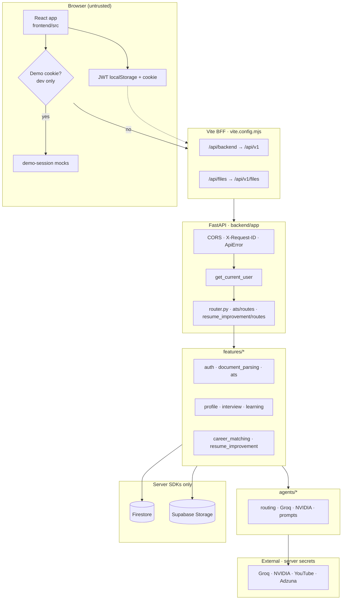
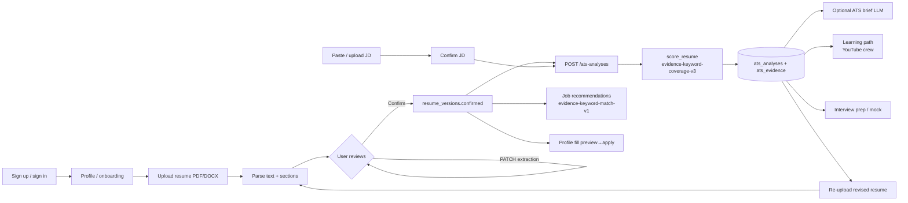
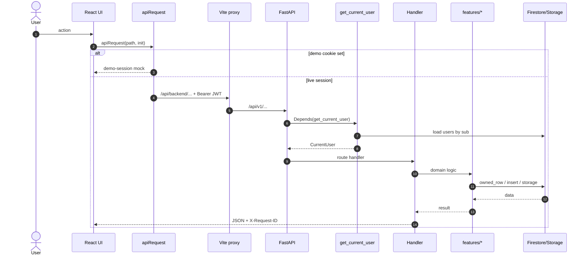
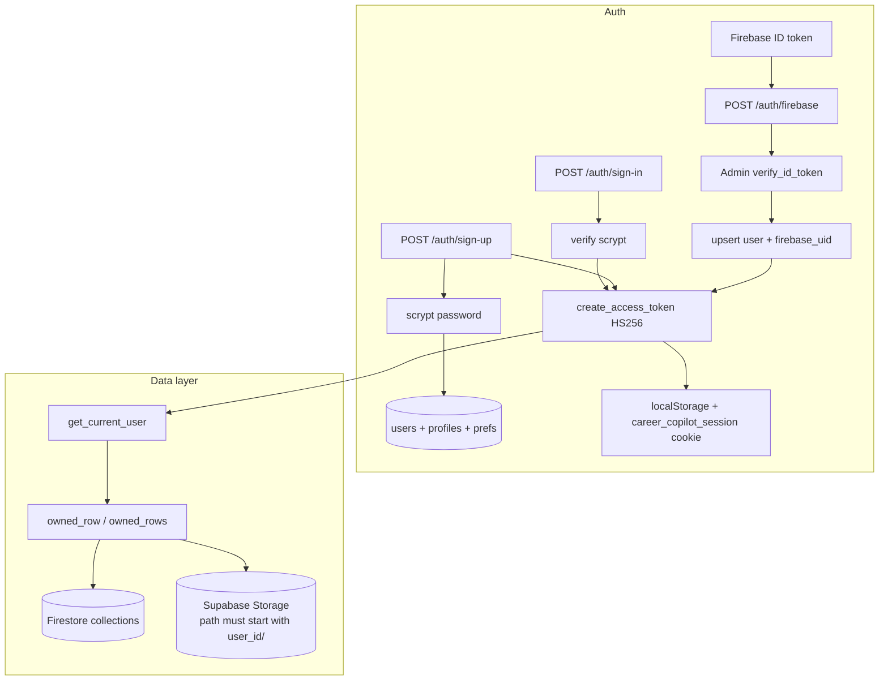
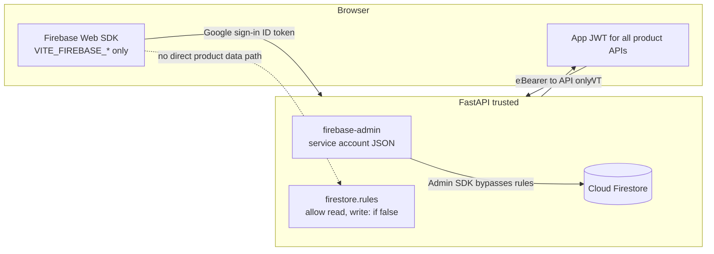
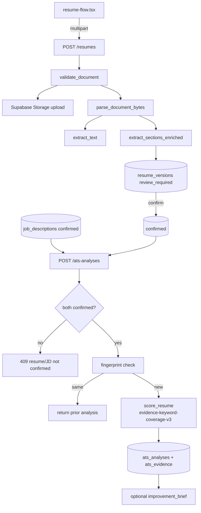
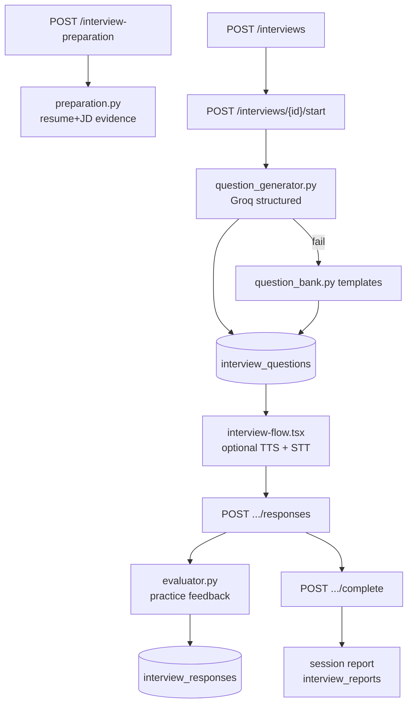
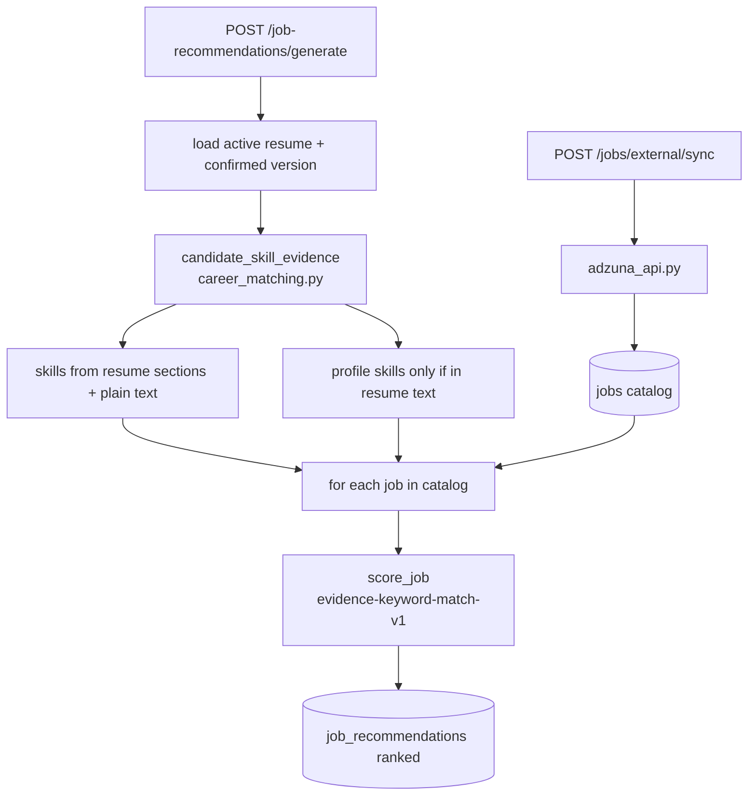
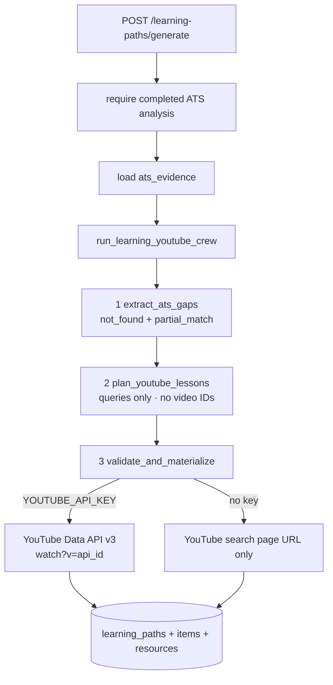
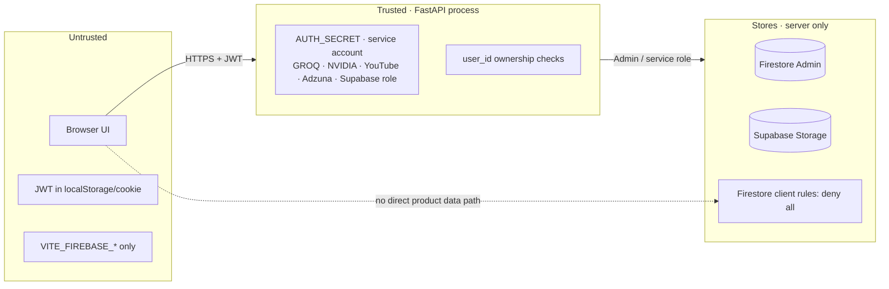

# Career Copilot — Unified Technical Documentation

**Version:** 1.0.0  
**Source of truth:** this file (generated from the repository as of the last documentation update)  
**Scope:** product purpose, problem statement, tech stack, architecture, data model, APIs, agents, code map, flows, operations, and Mermaid diagrams  

> **Golden rule:** Do not invent the candidate’s career. Only text the user types, uploads, **confirms**, or explicitly accepts is used for ATS, learning gaps, interview evidence, and job matching. LLM / YouTube / Adzuna / storage service keys stay on the server. The browser never talks to Firestore directly.

---

## Table of contents

1. [Aim and problem statement](#1-aim-and-problem-statement)
2. [What the product does (and does not)](#2-what-the-product-does-and-does-not)
3. [Tech stack](#3-tech-stack)
4. [Models, frameworks, and libraries](#4-models-frameworks-and-libraries)
5. [Project architecture](#5-project-architecture)
6. [How the project works (end-to-end)](#6-how-the-project-works-end-to-end)
7. [Agents](#7-agents)
8. [Data model (Firestore + Supabase Storage)](#8-data-model-firestore--supabase-storage)
9. [API surface](#9-api-surface)
10. [Code map — every application file and purpose](#10-code-map--every-application-file-and-purpose)
11. [Feature deep-dives](#11-feature-deep-dives)
12. [Frontend routes and BFF](#12-frontend-routes-and-bff)
13. [Configuration and environment](#13-configuration-and-environment)
14. [Operations, scripts, and testing](#14-operations-scripts-and-testing)
15. [Mermaid diagrams](#15-mermaid-diagrams)
16. [Design principles and non-goals](#16-design-principles-and-non-goals)
17. [What is not used / outdated claims removed](#17-what-is-not-used--outdated-claims-removed)

---

## 1. Aim and problem statement

### Aim

Career Copilot is a **private career workspace for one candidate at a time**. It helps a job seeker:

1. Build a structured profile and upload a resume (PDF/DOCX).
2. Review extracted text/sections, then **confirm** them (confirm gate).
3. Score the resume against a confirmed job description with **exact keyword evidence**.
4. Practice mock interviews (optional browser voice Q&A) with practice feedback.
5. Generate free YouTube learning paths from ATS gaps (no invented video IDs).
6. Browse job recommendations grounded in **confirmed resume evidence**.

### Problem statement

Job seekers face fragmented tools and opaque “AI scores” that invent skills, employers, or metrics. Typical pain:

| Problem | Product response |
|---------|------------------|
| ATS scores with no proof | Deterministic keyword coverage + exact resume quotes (`evidence-keyword-coverage-v3`) |
| OCR/LLM extraction errors feed scoring silently | **Confirm gate** — only `confirmed` resume/JD text powers ATS, learning, prep evidence, job match |
| Invented YouTube videos / fake IDs | YouTube Data API or search-page URLs only (`ats-youtube-api-v1`) |
| Client-side DB access bypasses ownership | FastAPI + Admin SDK only; Firestore rules deny all client access |
| Secrets in the browser | Only `VITE_*` keys reach the frontend; service keys stay server-side |
| Over-promising “hireability AI” | No hiring-decision scores; interview feedback is **practice coaching**, not a recruiter verdict |

### Product goals

1. **Evidence-grounded ATS** — auditable keyword quotes.
2. **Confirm gate** — unreviewed extraction never drives product decisions.
3. **Helpful AI without invention** — LLMs plan/draft/brief; they do not invent experience or video IDs.
4. **Owned data lifecycle** — create, list, delete, full account wipe (`DELETE MY ACCOUNT`).

---

## 2. What the product does (and does not)

### Features (included)

| Area | What you get |
|------|----------------|
| **Auth** | Email/password (scrypt) + app JWT; optional Google via Firebase ID-token exchange |
| **Profile** | Structured fields, avatar, completion checklist (0–100), fill-from-resume preview → apply |
| **Resume / JD** | Upload or paste → review → **confirm** |
| **ATS** | Deterministic keyword coverage (`evidence-keyword-coverage-v3`); history shows resume + JD used |
| **Interviews** | Question packs + practice sessions; optional TTS / speech-to-text; practice answer evaluation & session report (Groq or deterministic heuristics) — **not** a hiring prediction |
| **Learning** | ATS gaps → YouTube videos (API) or search-page URLs only |
| **Jobs** | Evidence-based recommendations; optional Adzuna sync |
| **Resume improvement** | Evidence-checked rewrite suggestions via crew (API); primary product loop remains re-upload |
| **Account wipe** | Confirm with phrase `DELETE MY ACCOUNT` |

### Not included (by design)

- Invented skills, employers, metrics, or YouTube video IDs
- AI hiring decisions or “you will get the job” scores
- Product-path embedding / cosine-similarity ATS
- Direct browser access to Firestore or storage service keys
- Multi-tenant recruiter portal
- Firebase Storage as the product object store (product files use **Supabase Storage**)

---

## 3. Tech stack

| Layer | Technology | Role in this repo |
|-------|------------|-------------------|
| **Frontend** | Vite 8, React 19, TypeScript 5.9, React Router 7, Tailwind CSS 4 | SPA UI, BFF proxy in dev |
| **UI libs** | Base UI (`@base-ui/react`), Lucide icons, Motion, class-variance-authority | Components, icons, motion |
| **3D / globe** | Three.js, React Three Fiber/Drei, Cobe | Jobs globe visualization |
| **Auth client** | Firebase Web SDK (`firebase`) | Optional Google sign-in only |
| **Backend** | FastAPI, Uvicorn, Pydantic v2, pydantic-settings | HTTP API, validation, DI |
| **Auth server** | PyJWT (HS256), scrypt passwords | App JWT + password hashes |
| **Database** | Cloud Firestore via `firebase-admin` | Structured candidate data |
| **Object storage** | Supabase Storage (HTTP API, service role) | Resumes, avatars, exports |
| **Documents** | pypdf, python-docx; optional pymupdf, pdfplumber | PDF/DOCX text extract |
| **PDF export** | reportlab | Resume export generation |
| **HTTP client** | httpx | LLM providers, YouTube, Adzuna, Supabase |
| **LLM** | Groq (preferred default), NVIDIA Integrate (fallback) | OpenAI-compatible chat APIs |
| **Crews** | Optional official `crewai`; else built-in sequential orchestrator | Learning + resume improvement crews |
| **Optional sidecar** | OmniRoute (`OMNIROUTE_ENABLED`, default off) | OpenAI-compatible proxy rewrite |
| **Tooling** | Node 20+, npm scripts, pytest, ruff, Vitest, Playwright, ESLint | Setup, tests, e2e |

### Runtime versions

| Runtime | Constraint |
|---------|------------|
| Node.js | 20+ |
| Python | 3.11–3.13 (repo pin often 3.12; `requires-python = ">=3.11,<3.14"`) |

### Monorepo layout (high level)

```text
career-copilot/
├── frontend/          # Vite + React SPA
├── backend/           # FastAPI package career-copilot-api
├── docs/              # This documentation (DOCUMENTATION.md is canonical)
├── firebase/          # Client deny-all rules (product path is Admin SDK)
├── scripts/           # setup, dev, diagnostics
├── secrets/           # local service-account JSON (gitignored)
├── integrations/      # optional OmniRoute (off by default; not required to run app)
├── package.json       # root scripts
└── .env / .env.example
```

---

## 4. Models, frameworks, and libraries

### Backend dependencies (`backend/pyproject.toml`)

| Package | Purpose |
|---------|---------|
| `fastapi` | REST API framework |
| `uvicorn[standard]` | ASGI server |
| `pydantic` / `pydantic-settings` | Request/response models + env settings |
| `python-dotenv` | `.env` loading support |
| `httpx` | Outbound HTTP (LLMs, YouTube, Adzuna, Supabase) |
| `python-multipart` | File uploads |
| `pypdf` | PDF text extraction (default chain) |
| `python-docx` | DOCX read + export path |
| `reportlab` | PDF export generation |
| `PyJWT[crypto]` | App JWT sign/verify |
| `firebase-admin` | Firestore Admin + Firebase ID token verify |

**Optional extras**

| Extra | Packages | When |
|-------|----------|------|
| `crewai` | `crewai>=0.80,<2` | Official CrewAI runtime for crews |
| `pdf-extras` | `pymupdf`, `pdfplumber` | Faster PDF backends tried before pypdf |
| `dev` | `pytest`, `ruff` | Tests and lint |

### Frontend dependencies (`frontend/package.json`)

| Package | Purpose |
|---------|---------|
| `react` / `react-dom` 19 | UI runtime |
| `react-router-dom` 7 | Client routing |
| `firebase` | Google Auth Web SDK |
| `@base-ui/react` | Accessible primitives |
| `lucide-react` | Icons |
| `motion` | Animations |
| `class-variance-authority` | Variant class helpers |
| `three` / `@react-three/fiber` / `@react-three/drei` | 3D globe |
| `cobe` | Lightweight globe alternative/helper |
| `vite` + `@vitejs/plugin-react` | Build & dev server |
| `tailwindcss` 4 + `@tailwindcss/postcss` | Styling |
| `typescript` | Types |
| `vitest` / `@testing-library/react` / `jsdom` | Unit tests |
| `@playwright/test` | E2E (landing) |
| `eslint` + plugins | Lint |

### LLM models (configured via env; not hard-coded as sole product truth)

Defaults from `.env.example` / `core/config.py`:

| Provider | Env keys | Typical model (template default) | Used for |
|----------|----------|----------------------------------|----------|
| **Groq** | `GROQ_API_KEY`, `GROQ_MODEL`, `GROQ_BASE_URL` | `llama-3.3-70b-versatile` | Interviews, ATS brief, learning planner, many agents when `LLM_PROVIDER=groq` |
| **Groq resume parser** | `GROQ_RESUME_PARSER_*` | `openai/gpt-oss-120b` + fallback `llama-3.3-70b-versatile` | Document section segregation path |
| **NVIDIA** | `NVIDIA_API_KEY`, `NVIDIA_MODEL`, `NVIDIA_BASE_URL` | `deepseek-ai/deepseek-v4-flash` (template) | Fallback / when preferred |
| Preference | `LLM_PROVIDER=groq\|nvidia` | — | Preferred first, then other configured provider |

**Interview questions** use **Groq only** (local templates on failure). **Product ATS score uses no LLM.**

### Algorithm versions (product)

| Algorithm | Constant | File |
|-----------|----------|------|
| ATS scoring | `evidence-keyword-coverage-v3` | `backend/app/features/ats/ats_score.py` |
| Job match | `evidence-keyword-match-v1` | `backend/app/features/career_matching.py` |
| Learning path | `ats-youtube-api-v1` | `backend/app/features/learning/youtube_catalog.py` |

### Prompt packs (`backend/app/agents/prompts/`)

| File | Used by |
|------|---------|
| `improve_resume_v1.txt` | Resume improvement |
| `fill_profile_from_resume_v1.txt` | Profile fill |
| `interview_questions_v1.txt` | Mock interview start |
| `interview_preparation_v1.txt` | Interview preparation |
| `interview_answer_eval_v1.txt` | Per-answer practice evaluation |
| `interview_session_report_v1.txt` | Session completion report |
| `ats_improvement_v1.txt` | ATS improvement brief |
| `learning_youtube_path_v1.txt` | Learning planner |
| `document_section_extract_v1.txt` | Section segregation |
| `repair_structured_output_v1.txt` | JSON repair pass (`LLM_ALLOW_REPAIR`) |

---

## 5. Project architecture

### Layered backend

```text
backend/app/
├── main.py                 # ASGI: CORS, request ID, exception handlers, routers
├── core/                   # settings, constants, ApiError
├── api/                    # HTTP surface (router, schemas, auth router)
├── database/               # Firestore + Supabase Storage adapters, ownership helpers
├── agents/                 # provider clients, prompts, registry, preferred routing
└── features/               # domain modules (auth, parsing, ATS, interview, …)
```

### Trust boundaries

| Boundary | Rule |
|----------|------|
| Browser | Untrusted; never holds service keys |
| Vite BFF | Dev/preview proxy only; not a second auth system |
| FastAPI | Authenticates JWT; owns multi-tenant isolation |
| Firestore rules | Deny all client SDK access (`firebase/firestore.rules`) |
| Storage | Private Supabase bucket; bytes only via authenticated `/files` route |

### Request path (local dev)

```text
Browser (Vite + React)
  Authorization: Bearer <JWT>
        │
        ├─ /api/backend/*  ──Vite proxy──►  FastAPI /api/v1/*
        └─ /api/files/*    ──Vite proxy──►  FastAPI /api/v1/files/*
                │
                ▼
           FastAPI (ownership enforced)
                ├─ Firestore      (rows)
                ├─ Supabase Storage (files under {user_id}/…)
                └─ Groq / NVIDIA / YouTube / Adzuna  (server .env)
```

See [§15 Mermaid diagrams](#15-mermaid-diagrams) for architecture, auth/db, Firebase, ATS, mock interview, jobs, and learning path.

---

## 6. How the project works (end-to-end)

### 6.1 Boot

1. Root `npm run dev` → `scripts/dev/preflight.mjs` (env/Firestore checks) → spawns frontend + backend.
2. Backend: `uvicorn app.main:app` loads `Settings` from root `.env`.
3. Frontend: Vite on `127.0.0.1:3000` with proxy to `PUBLIC_API_BASE_URL` (default `http://127.0.0.1:8000`).

### 6.2 Authenticated API call

```text
UI → shared/api/client.ts :: apiRequest
  → if demo cookie (dev only) → demo-session mocks (no network)
  → else Bearer JWT + credentials include
  → /api/backend/... → Vite rewrite → /api/v1/...
  → get_current_user (JWT + load users row)
  → handler → features/* → database/client (owned rows / storage)
```

### 6.3 Confirm gate (central product rule)

```text
pending → processing → review_required → confirmed
                              ↘ failed
```

Only **`confirmed`** resume versions and job descriptions may enter ATS, learning generation, interview prep evidence, and job-match evidence paths.

### 6.4 Primary candidate journey

1. **Sign up / sign in** → app JWT  
2. **Profile / onboarding**  
3. **Upload resume** → parse → review → **confirm**  
4. **Paste/upload JD** → review → **confirm**  
5. **ATS analysis** → evidence rows + optional LLM brief  
6. Optional: **learning path**, **interview prep/mock**, **job recommendations**, **profile fill**, **resume improvement**  
7. Iterate by re-uploading a revised resume  

### 6.5 Provider routing

`backend/app/agents/providers/routing.py`:

- `preferred_llm_provider(settings)` → `LLM_PROVIDER` (`groq` | `nvidia`)
- `preferred_llm_providers(settings)` → configured providers in preference order

Agents try preferred first, then the other, then deterministic behavior where defined.

Optional **OmniRoute** (`OMNIROUTE_ENABLED=false` by default) can rewrite provider base URL/key when a local OpenAI-compatible sidecar is running. Deleting `integrations/omniroute` does not break the app when OmniRoute is disabled.

### 6.6 Data access notes

- Firestore queries that `order_by("created_at")` **omit documents missing that field**. User-scoped lists use fetch + `sort_rows_by_recency` (`database/repository.py`). New writes always set `created_at`.
- Object storage (`database/client.py`): in-memory when `APP_ENV=test`; else Supabase when URL + service role + bucket are set; fail closed otherwise.

---

## 7. Agents

Inventory is defined in `backend/app/agents/registry.py` and exposed at `GET /api/v1/agents/status` and in health summaries.

| ID | Name | Provider | Prompt(s) | Endpoint | Fallback |
|----|------|----------|-----------|----------|----------|
| `resume_improvement` | Resume improvement | preferred LLM | `improve_resume_v1.txt` | `POST /resume-improvements` | Manual edit / re-upload |
| `resume_improvement_crew` | Resume improvement crew | preferred + CrewAI-compat | improve + crew tools | same | Sequential built-in if no official crewai |
| `profile_fill` | Profile fill from resume | preferred LLM | `fill_profile_from_resume_v1.txt` | `POST /profile/from-resume/preview` | Deterministic mapping |
| `interview_questions` | Interview question generation | **Groq only** | `interview_questions_v1.txt` | `POST /interviews/{id}/start` | Local templates |
| `interview_evaluation` | Answer evaluation & debrief | Groq or deterministic | `interview_answer_eval_v1.txt` + `interview_session_report_v1.txt` | responses + complete | Heuristic scoring + filler detection |
| `ats_improvement_brief` | ATS improvement brief | preferred LLM | `ats_improvement_v1.txt` | `POST /ats-analyses` (summary) | Deterministic missing-keyword brief |
| `learning_youtube_crew` | Learning path YouTube crew | Groq + tools | `learning_youtube_path_v1.txt` | `POST /learning-paths/generate` | Deterministic gap→search plan |
| `document_section_extract` | Document section segregation | preferred LLM | `document_section_extract_v1.txt` | resume/JD upload | Structural layout parser |

### Provider clients

| File | Role |
|------|------|
| `agents/providers/groq_client.py` | Groq OpenAI-compatible client |
| `agents/providers/nvidia_client.py` | NVIDIA Integrate client |
| `agents/providers/common.py` | Shared completion / JSON helpers |
| `agents/providers/rate_limit.py` | Process-level RPM (`LLM_RPM_LIMIT`) |
| `agents/providers/routing.py` | Preferred order; optional OmniRoute rewrite |
| `agents/providers/prompts.py` | Load prompt text files |
| `agents/registry.py` | Agent inventory + status |

### Crew runtimes

- **Official `crewai`** when installed (`pip install -e "backend/.[crewai]"`) and Python allows.
- Otherwise **built-in sequential orchestrator** (same tool steps; compatible shape in `resume_improvement/agents/crew/compat.py`).

Crews used in product paths:

1. **Learning YouTube crew** — gap extract → plan queries → validate/materialize (API or search URLs).  
2. **Resume improvement crew** — gap analyze → LLM improve → evidence validate.

**Not product persist path:** optional composite LLM ATS under `features/ats/agent/` + `features/ats/scoring/` is library/tests only. Product `POST /ats-analyses` always uses deterministic `score_resume`.

---

## 8. Data model (Firestore + Supabase Storage)

### Stores

| Store | Role |
|-------|------|
| **Cloud Firestore** | Structured candidate data |
| **Supabase Storage** | Binary objects (resumes, avatars, exports) |

Access path: **FastAPI only** (Admin SDK + service role). Browser rules deny direct Firestore access.

### Ownership

Almost every candidate row includes `user_id` and `id`. Helpers: `owned_row` / `owned_rows`, `sort_rows_by_recency` in `database/repository.py`.

### Collections

#### Identity

| Collection | Key fields | Created by |
|------------|------------|------------|
| `users` | `id`, `email`, `password_hash`, `full_name`, optional `firebase_uid` | Sign-up, Firebase exchange |
| `profiles` | `id` (= user id), completion fields, avatar paths | Signup + profile patches |

#### Preferences

| Collection | Notes |
|------------|--------|
| `candidate_preferences` | Target roles, locations, work modes, etc. |
| `notification_preferences` | Notification toggles |
| `privacy_preferences` | Privacy toggles |

#### Profile content (`CANDIDATE_TABLES`)

| API resource | Collection |
|--------------|------------|
| `skills` | `candidate_skills` |
| `experiences` | `candidate_experiences` |
| `projects` | `candidate_projects` |
| `education` | `candidate_education` |
| `certifications` | `candidate_certifications` |
| `languages` | `candidate_languages` |
| `links` | `candidate_links` |

#### Documents

| Collection | Purpose |
|------------|---------|
| `resumes` | Parent (`title`, `is_active`, soft `deleted_at`, `created_at`) |
| `resume_versions` | File version: text, structured content, extraction status, `storage_path` |
| `job_descriptions` | JD text/file, metadata, extraction status |

Key fields: `plain_text` / `raw_text`, `structured_content`, `extraction_status`, `candidate_confirmed_at`, `storage_path`, `created_at`.

#### ATS

| Collection | Purpose |
|------------|---------|
| `ats_analyses` | Score run: status, overall score, breakdown, summary, algorithm version |
| `ats_evidence` | One row per JD term: match status, exact quote or null |

Idempotency: fingerprint of source text + confirm times; unchanged fingerprint returns existing completed analysis.

#### Resume improvement

| Collection | Purpose |
|------------|---------|
| `resume_improvement_runs` | Job metadata |
| `resume_suggestions` | Accept/reject/edit suggestions |
| `resume_exports` | Generated export files |

#### Interview

| Collection | Purpose |
|------------|---------|
| `interview_sessions` | Mode, role, difficulty, camera/mic flags, status |
| `interview_questions` | Generated questions + source_context |
| `interview_responses` | Typed text / transcript fields |
| `interview_reports` | Completion artifacts (practice feedback; not hiring decisions) |

#### Learning

| Collection | Purpose |
|------------|---------|
| `learning_paths` | Path metadata, progress, source analysis id |
| `learning_items` | Steps |
| `learning_resources` | YouTube watch or search URLs |

#### Jobs

| Collection | Purpose |
|------------|---------|
| `jobs` | Local catalog (optional Adzuna fill) |
| `job_recommendations` | Ranked matches |
| `saved_jobs` | User bookmarks |

#### Activity

| Collection | Purpose |
|------------|---------|
| `activity_events` | Dashboard recent activity (pruned; `created_at` on write) |

### Object storage layout

Bucket: `SUPABASE_STORAGE_BUCKET` (default `career-copilot-files`).

Logical prefixes:

| Env | Typical value | Contents |
|-----|---------------|----------|
| `DOCUMENT_BUCKET` | `candidate-documents` | Resumes, JDs, exports |
| `AVATAR_BUCKET` | `candidate-avatars` | Profile images |

```text
{SUPABASE_STORAGE_BUCKET}/
  {DOCUMENT_BUCKET}/{user_id}/resumes/...
  {DOCUMENT_BUCKET}/{user_id}/job-descriptions/...
  {AVATAR_BUCKET}/{user_id}/avatars/...
```

Browser download: `GET /api/v1/files/{bucket}/{path}` with JWT; path must start with `{user_id}/`. Vite maps `/api/files/*` to that route.

### Account deletion cascade

`features/auth/account_deletion.py`: confirm phrase **`DELETE MY ACCOUNT`**, collect storage paths, purge objects, delete `USER_OWNED_TABLES` then profile/user.

---

## 9. API surface

Base path: **`/api/v1`** (`API_V1_PREFIX`).  
Browser (local Vite): **`/api/backend/...`** → `/api/v1/...`.  
Files: **`/api/files/...`** → `/api/v1/files/...`.  
OpenAPI (non-production): `http://127.0.0.1:8000/docs`.

Implementation: `backend/app/api/router.py`, `backend/app/api/routers/auth.py`, `features/ats/routes.py`, `features/resume_improvement/routes.py`.

### Authentication

| Mechanism | Detail |
|-----------|--------|
| Header | `Authorization: Bearer <JWT>` (preferred) |
| Cookie | `career_copilot_session=<JWT>` |
| Algorithm | HS256 (`core/constants.py`) |
| Secret | `AUTH_SECRET` |
| Claims | `sub` (user id), `email`, `iat`, `exp` |
| Dep | `features/auth/service.py` → `get_current_user` |

### Endpoint map

| Area | Endpoints (prefix `/api/v1`) |
|------|------------------------------|
| Auth | `POST /auth/sign-up`, `/sign-in`, `/session`, `/firebase`, `/sign-out`, `/update-password`; stubs: `/resend`, `/reset-password` |
| Health | `GET /health`, `/health/database`, `/agents/status` |
| Me | `GET /me/bootstrap`, `/me/activity` |
| Profile | `/profile`, avatar, preferences, child resources, from-resume preview/apply |
| Resumes / JDs | `/resumes`, versions, confirm; `/job-descriptions` |
| ATS | `/ats-analyses`, evidence, suggestions; `POST /ats/score` (stateless) |
| Improvement | `/resume-improvements*`, suggestions, apply, exports |
| Interview | `/interview-preparation`, `/interviews` (+ start / responses / complete) |
| Learning | `/learning-paths`, `/learning-paths/generate` |
| Jobs | `/jobs`, recommendations, saved jobs, optional external sync |
| Settings | `/settings`, notifications, privacy |
| Account | `DELETE /account` |
| Files | `GET /files/{bucket}/{path}` |

### Error shape

```json
{
  "error": {
    "code": "authentication_required",
    "message": "Authentication is required.",
    "details": null,
    "request_id": "uuid"
  }
}
```

Every response includes `X-Request-ID` (middleware in `main.py`).

### Rate limits and caps

| Area | Behavior |
|------|----------|
| LLM | Process-level RPM via `LLM_RPM_LIMIT` + `rate_limit.py` |
| Lists | User-owned; newest-first via in-process recency sort when timestamps may be missing |
| ATS terms | Cap 80 JD terms in scorer |
| Improvement | `IMPROVEMENT_MAX_SECTIONS`, source/JD char caps |

---

## 10. Code map — every application file and purpose

Paths relative to repository root. Excludes `node_modules`, `__pycache__`, `dist`, and vendored `integrations/omniroute` internals (optional sidecar).

### Root

| Path | Purpose |
|------|---------|
| `package.json` | Monorepo scripts: setup, dev, checks, `test:backend` |
| `.env` / `.env.example` | Single env file for frontend + backend |
| `README.md` | Product overview + quick start |
| `docs/DOCUMENTATION.md` | **This unified documentation (canonical)** |
| `firebase/firestore.rules` | Deny all client Firestore access |
| `firebase/storage.rules` | Legacy Firebase Storage rules (product files use Supabase) |
| `scripts/` | Install, dev orchestration, diagnostics |
| `secrets/` | Local service-account JSON (**gitignored**) |

### Scripts

| Path | Purpose |
|------|---------|
| `scripts/setup/project.mjs` | Full install orchestration |
| `scripts/setup/backend.mjs` | Create venv, `pip install -e backend` |
| `scripts/setup/firebase.mjs` | Firebase connectivity checks |
| `scripts/dev/preflight.mjs` | Env/Firestore preflight before `dev` |
| `scripts/dev/run.mjs` | Spawn frontend + backend |
| `scripts/dev/frontend.mjs` | Frontend process launcher |
| `scripts/dev/backend.mjs` | Backend process launcher |
| `scripts/shared/load-env.mjs` | Load root `.env` for Node scripts |
| `scripts/shared/ports.mjs` | Port resolution |
| `scripts/shared/backend-venv.mjs` | Locate `backend/.venv` Python |
| `scripts/diagnostics/verify-environment.mjs` | `npm run check:env` |
| `scripts/diagnostics/check-secrets.mjs` | Credential leak scan |
| `scripts/diagnostics/check-firestore.py` | Firestore probe |
| `scripts/diagnostics/e2e-smoke.py` | API workflow smoke |
| `scripts/diagnostics/audit-local-api.py` | Local API audit |
| `scripts/diagnostics/_audit_once.py` | Offline stack audit |
| `scripts/diagnostics/check-resume-proceed.mjs` | Resume flow diagnostic |
| `scripts/verify-boundaries.mjs` | Import boundary checks |
| `scripts/run-frontend.mjs` | Run frontend npm tasks from root |
| `scripts/integrations/omniroute.mjs` | Optional OmniRoute install/dev/check |

### Backend core and entry

| Path | Purpose |
|------|---------|
| `backend/pyproject.toml` | Package `career-copilot-api`, deps, ruff, optional extras |
| `backend/app/__init__.py` | Package marker |
| `backend/app/main.py` | FastAPI app: CORS, middleware, exception handlers, router mounts |
| `backend/app/core/__init__.py` | Core package |
| `backend/app/core/config.py` | `Settings` from root `.env`; provider validators |
| `backend/app/core/constants.py` | JWT algo, password min length, optional ATS composite weights |
| `backend/app/core/errors.py` | `ApiError` + JSON error handlers |

### Backend API

| Path | Purpose |
|------|---------|
| `backend/app/api/__init__.py` | API package |
| `backend/app/api/router.py` | **Primary HTTP surface** — product routes, account, ATS persist, interviews, learning, jobs |
| `backend/app/api/schemas.py` | Pydantic request bodies |
| `backend/app/api/routers/auth.py` | Auth router: sign-up/in, Firebase exchange, password helpers |

### Backend database

| Path | Purpose |
|------|---------|
| `backend/app/database/__init__.py` | Database package |
| `backend/app/database/client.py` | Firestore query adapter, table allow-list, Supabase storage facade |
| `backend/app/database/repository.py` | `owned_row(s)`, recency sort, activity, profile completion, `CANDIDATE_TABLES` |
| `backend/app/database/activity.py` | Activity prune limits and helpers |

### Backend agents

| Path | Purpose |
|------|---------|
| `backend/app/agents/__init__.py` | Re-exports for agent helpers |
| `backend/app/agents/registry.py` | Agent inventory for `/agents/status` |
| `backend/app/agents/providers/__init__.py` | Provider exports |
| `backend/app/agents/providers/common.py` | Shared completion / JSON helpers |
| `backend/app/agents/providers/groq_client.py` | Groq client |
| `backend/app/agents/providers/nvidia_client.py` | NVIDIA client |
| `backend/app/agents/providers/prompts.py` | Load prompt files |
| `backend/app/agents/providers/rate_limit.py` | RPM budget |
| `backend/app/agents/providers/routing.py` | Preferred provider order; OmniRoute rewrite |
| `backend/app/agents/prompts/*.txt` | Versioned prompt packs (see §4) |

### Backend features — auth

| Path | Purpose |
|------|---------|
| `backend/app/features/auth/__init__.py` | Auth package |
| `backend/app/features/auth/service.py` | `CurrentUser`, JWT create/decode, `get_current_user` |
| `backend/app/features/auth/account_deletion.py` | Confirm phrase, storage path collect, cascade delete |

### Backend features — profile

| Path | Purpose |
|------|---------|
| `backend/app/features/profile/__init__.py` | Profile package |
| `backend/app/features/profile/completion.py` | Checklist weights → 0–100 |
| `backend/app/features/profile/avatars.py` | Upload validation, storage paths |
| `backend/app/features/profile/importer.py` | Apply validated batch from draft |
| `backend/app/features/profile/agent/__init__.py` | Agent package |
| `backend/app/features/profile/agent/pipeline.py` | Fill-from-resume orchestration |
| `backend/app/features/profile/agent/deterministic.py` | Non-LLM mapping |
| `backend/app/features/profile/agent/normalize.py` | Date/value normalization |

### Backend features — document parsing

| Path | Purpose |
|------|---------|
| `backend/app/features/document_parsing/__init__.py` | Parsing package |
| `backend/app/features/document_parsing/pipeline.py` | `parse_document_bytes` public entry |
| `backend/app/features/document_parsing/service.py` | Validate, skills candidates, metadata helpers |
| `backend/app/features/document_parsing/schemas.py` | Extraction schemas |
| `backend/app/features/document_parsing/confidence.py` | Confidence helpers |
| `backend/app/features/document_parsing/contamination.py` | Contamination checks |
| `backend/app/features/document_parsing/grounding.py` | Grounding utilities |
| `backend/app/features/document_parsing/reconciliation.py` | Merge/reconcile helpers |
| `backend/app/features/document_parsing/source_blocks.py` | Source block types |
| `backend/app/features/document_parsing/parsing/text_extract.py` | PDF/DOCX text extraction chain |
| `backend/app/features/document_parsing/parsing/llm_sections.py` | LLM line→section mapping |
| `backend/app/features/document_parsing/parsing/sections.py` | Structural/heuristic sections |
| `backend/app/features/document_parsing/extractors/pdf.py` | Lightweight PDF blocks |
| `backend/app/features/document_parsing/extractors/docx.py` | DOCX blocks |

### Backend features — ATS

| Path | Purpose |
|------|---------|
| `backend/app/features/ats/__init__.py` | ATS package |
| `backend/app/features/ats/ats_score.py` | **Product scorer** `evidence-keyword-coverage-v3` |
| `backend/app/features/ats/deterministic.py` | Deterministic helpers |
| `backend/app/features/ats/routes.py` | Stateless `POST /ats/score` |
| `backend/app/features/ats/agents/improvement_brief.py` | LLM/deterministic brief after score |
| `backend/app/features/ats/agent/*` | Optional CrewAI structured ATS **library** (not product persist path) |
| `backend/app/features/ats/scoring/*` | Optional composite scoring service/schemas (library/tests) |

### Backend features — interview

| Path | Purpose |
|------|---------|
| `backend/app/features/interview/preparation.py` | Evidence-grounded prep packs |
| `backend/app/features/interview/question_bank.py` | Local question templates |
| `backend/app/features/interview/agent/question_generator.py` | Groq structured questions |
| `backend/app/features/interview/agent/evaluator.py` | Answer evaluation + session report (practice coaching) |

### Backend features — learning

| Path | Purpose |
|------|---------|
| `backend/app/features/learning/__init__.py` | Learning package |
| `backend/app/features/learning/service.py` | `generate_learning_path_from_ats` |
| `backend/app/features/learning/youtube_api.py` | YouTube Data API v3 client |
| `backend/app/features/learning/youtube_catalog.py` | Algorithm version + catalog helpers |
| `backend/app/features/learning/agents/crew/orchestrator.py` | Sequential crew wiring |
| `backend/app/features/learning/agents/crew/tools.py` | Gap extract, plan, materialize tools |
| `backend/app/features/learning/agents/crew/models.py` | Crew result types |

### Backend features — jobs & resume improvement

| Path | Purpose |
|------|---------|
| `backend/app/features/career_matching.py` | Job match score `evidence-keyword-match-v1` |
| `backend/app/features/adzuna_api.py` | External job sync client |
| `backend/app/features/resume_management/evidence.py` | Evidence hashing / validation |
| `backend/app/features/resume_management/validation.py` | Suggestion validation |
| `backend/app/features/resume_management/improvements.py` | Improvement domain logic |
| `backend/app/features/resume_management/improvement_repository.py` | Persistence for runs/suggestions |
| `backend/app/features/resume_management/exports.py` | PDF/DOCX export generation |
| `backend/app/features/resume_improvement/routes.py` | HTTP for improvement |
| `backend/app/features/resume_improvement/agents/crew/*` | Gap → improve → validate crew + compat runtime |

### Backend tests (overview)

| Path | Purpose |
|------|---------|
| `backend/tests/ats_scoring/` | Keyword score, gate, schemas, service, enrichment |
| `backend/tests/document_parsing/` | Sections, validation, e2e parse, performance |
| `backend/tests/interview/` | Preparation, answer evaluator, question fallback |
| `backend/tests/learning/` | YouTube crew |
| `backend/tests/fixtures/resumes/` | PDF/DOCX/JSON fixtures |
| `backend/tests/test_*.py` | Auth, avatars, jobs sync, rate limit, Firestore guards, LLM routing |

### Frontend entry and shared

| Path | Purpose |
|------|---------|
| `frontend/package.json` | Vite app scripts and deps |
| `frontend/vite.config.mjs` | Alias `@`, BFF proxy rewrite |
| `frontend/index.html` | SPA shell |
| `frontend/src/main.tsx` | React bootstrap |
| `frontend/src/App.tsx` | Routes, lazy imports, `ProtectedRoute` |
| `frontend/src/globals.css` | Theme tokens / Tailwind |
| `frontend/src/vite-env.d.ts` | Vite types |
| `frontend/src/shared/api/client.ts` | Authenticated `apiRequest` |
| `frontend/src/shared/config.ts` | Token keys, demo cookie, API base |
| `frontend/src/shared/routes.ts` | Route constants |
| `frontend/src/shared/router.ts` | Router helpers |
| `frontend/src/shared/theme.tsx` | Theme provider |
| `frontend/src/shared/theme-utils.ts` | Theme utilities |
| `frontend/src/shared/utils.ts` | Shared utils |
| `frontend/src/shared/dynamic.tsx` | Dynamic import helper |
| `frontend/src/shared/ui/*` | Shared UI (primitives, job-ticker, parallax, router-link) |
| `frontend/src/components/ui/*` | Design-system primitives (button, card, dialog, …) |

### Frontend features

| Path | Purpose |
|------|---------|
| `features/auth/api/client.ts` | Sign-in/up, token save (clears demo cookie) |
| `features/auth/components/auth-screen.tsx` | Auth screens |
| `features/auth/firebase.ts` | Google Web SDK |
| `features/auth/demo-session.ts` | Dev-only in-memory API mocks |
| `features/auth/safe-path.ts` | Safe redirect path |
| `features/dashboard/components/dashboard.tsx` | Dashboard metrics + activity |
| `features/dashboard/components/interview-progress-charts.tsx` | Interview progress charts |
| `features/resume/components/resume-flow.tsx` | Resume library, ATS history, report |
| `features/resume/analysis-labels.ts` | Label helpers for analyses |
| `features/interview/components/interview-flow.tsx` | Mock interview session UI |
| `features/interview/components/interview-preparation.tsx` | Prep UI |
| `features/interview/interview-voice.ts` | TTS / speech recognition pure helpers |
| `features/interview/preparation.ts` | Prep client helpers |
| `features/learning/components/learning.tsx` | Learning paths UI |
| `features/jobs/components/jobs.tsx` | Jobs list/detail |
| `features/jobs/components/career-globe.tsx` | 3D globe |
| `features/jobs/components/globe-utils.ts` | Globe helpers |
| `features/jobs/components/job-card-skeleton.tsx` | Loading skeleton |
| `features/jobs/components/job-modal.tsx` | Job modal |
| `features/jobs/components/job-types.ts` | Job TypeScript types |
| `features/jobs/utils/globe-lifecycle.ts` | Globe mount/unmount lifecycle |
| `features/settings/components/settings.tsx` | Profile, account, preferences, privacy |
| `features/onboarding/components/onboarding.tsx` | First-run onboarding |
| `features/marketing/components/landing.tsx` | Marketing landing |
| `features/marketing/components/sections/*` | Landing sections |
| `features/workspace/components/workspace-shell.tsx` | Nav / workspace chrome |
| `features/profile/components/profile-completion-toast.tsx` | Completion toast |
| `features/profile/model/profile-completion.ts` | Completion model helpers |
| `frontend/public/icon.svg` | App icon |

---

## 11. Feature deep-dives

### 11.1 Auth

**Password storage** (`api/routers/auth.py`): `scrypt(password, salt, n=2**14, r=8, p=1)` stored as `scrypt$salt_hex$digest_hex`; verify with `hmac.compare_digest`. Min length: `MIN_PASSWORD_LENGTH` (8).

**JWT:** payload `sub`, `email`, `iat`, `exp`; signed with `AUTH_SECRET`, HS256; TTL `JWT_TTL_SECONDS` (default 7 days).

**Sign-up graph:** `users` → `profiles` → `candidate_preferences` → `notification_preferences` → `privacy_preferences` (rollback children on failure).

**Google (optional):** Firebase Web SDK → ID token → `POST /auth/firebase` → server verifies → upserts user → issues **app JWT** (API still uses app JWT, not Firebase ID tokens long-term).

**Frontend tokens:** `localStorage[career_copilot_access_token]` + cookie `career_copilot_session`.

### 11.2 Document parsing & confirm

Entry: `parse_document_bytes` (`pipeline.py`).

1. Extract text (`text_extract.py`: PyMuPDF → pdfplumber → pypdf for PDF; python-docx for DOCX; quality gates).  
2. Section segregation (`llm_sections.py` preferred LLM, else structural `sections.py`).  
3. Bodies reconstructed only from source lines.  
4. Persist `extraction_status=review_required`.  
5. User may PATCH extraction → **confirm** → `confirmed`.

### 11.3 ATS scoring (product)

| Item | Value |
|------|--------|
| File | `features/ats/ats_score.py` |
| Version | `evidence-keyword-coverage-v3` |
| Persist | `POST /ats-analyses` |
| Stateless | `POST /ats/score` |

Steps:

1. Extract JD terms (required weight 2.0, preferred 1.0).  
2. Match resume lines (structured sections preferred) with alias groups.  
3. Strong = 1.0, partial = 0.5, missing = 0.0.  
4. Weighted overall 0–100.  
5. Evidence = exact resume quote or `null`.  

Optional brief: `improvement_brief.py` via preferred LLM (capped timeout); deterministic fallback. History enriched with resume + JD labels.

### 11.4 Profile

Completion checklist (`completion.py`) sums to **100** points (name, location, role, targets, experience, skills, education, work modes, locations, links). Recalculated on mutations via `recalculate_completion`.

Fill-from-resume: **preview → apply** human gate; deterministic merge always available.

### 11.5 Mock interview

```text
POST /interviews → start → responses → complete
```

- Questions: Groq structured or local templates.  
- Optional browser voice: Web Speech Synthesis + Recognition (Chromium / secure context).  
- Media uploads disabled when `INTERVIEW_MEDIA_MAX_BYTES=0` (text/transcript only).  
- Evaluation: practice feedback (verdict, strengths, improvements, filler notes) + session report — **coaching**, not a recruiter hire/no-hire decision.

### 11.6 Learning path

Algorithm `ats-youtube-api-v1`:

1. Extract gaps from `ats_evidence` (`not_found` / `partial_match`).  
2. Plan YouTube **search queries** (no video IDs from the model).  
3. Materialize: YouTube Data API (`watch?v=<api_id>`) or search-page URL only.  

Persist `learning_paths` + items + resources.

### 11.7 Job recommendations

Algorithm `evidence-keyword-match-v1` (`career_matching.py`):

- Evidence from **confirmed** resume text/sections; profile skills only if grounded in resume text.  
- With requirements: ~`(matched/requirements)*80 + min(role_hits, 4)*5`.  
- Without requirements: `min(role_hits*12, 40)`.  
- Boundary-aware phrase matching.  
- Optional catalog fill: Adzuna (`POST /jobs/external/sync`).

### 11.8 Resume improvement

Crew: gap analyze → LLM generate → evidence validate. Suggestions accept/reject/edit; export PDF/DOCX. Primary product loop remains re-upload after local edits.

---

## 12. Frontend routes and BFF

| Path | Module |
|------|--------|
| `/` | Marketing landing |
| `/sign-in`, `/sign-up`, … | Auth screens |
| `/onboarding` | Onboarding |
| `/dashboard` | Bootstrap metrics + activity |
| `/resume-analysis` | ATS history, resume library, upload |
| `/resume-analysis/report/:id` | ATS report + evidence |
| `/mock-interview/*` | Setup, session, preparation |
| `/learning/*` | Paths |
| `/jobs/*` | Catalog, saved, detail |
| `/settings/*` | Profile, account, preferences, privacy |

**API base:** `resolveApiBase()` uses `VITE_API_BASE_URL` if set (→ origin + `/api/v1`), else `/api/backend` for same-origin proxy.

**Demo mode:** cookie `career_copilot_demo=1` only in non-production; `apiRequest` short-circuits to in-memory mocks. Real sign-in clears the cookie. Production ignores demo.

---

## 13. Configuration and environment

Single root `.env` (template: `.env.example`). Only `VITE_*` is exposed to the browser.

| Group | Examples |
|-------|----------|
| App / CORS | `APP_ENV`, `API_V1_PREFIX`, `PUBLIC_API_BASE_URL`, `FRONTEND_ORIGINS` |
| Auth | `AUTH_SECRET`, `JWT_TTL_SECONDS` |
| Firestore | `FIREBASE_PROJECT_ID`, `FIREBASE_CREDENTIALS_PATH`, `FIREBASE_DATABASE_ID` |
| Storage | `SUPABASE_URL`, `SUPABASE_SERVICE_ROLE_KEY`, `SUPABASE_STORAGE_BUCKET`, `DOCUMENT_BUCKET`, `AVATAR_BUCKET` |
| LLM | `LLM_PROVIDER`, `GROQ_*`, `NVIDIA_*`, `LLM_RPM_LIMIT`, `LLM_ALLOW_REPAIR` |
| Optional | `YOUTUBE_API_KEY`, `ADZUNA_*`, `OMNIROUTE_*` (default off) |
| Browser | `VITE_FIREBASE_*` for Google sign-in |

Do **not** set `VITE_API_BASE_URL` for normal local dev (use Vite proxy).

---

## 14. Operations, scripts, and testing

### First-time setup

```bash
cp .env.example .env   # Windows: copy .env.example .env
# Set AUTH_SECRET, FIREBASE_*, SUPABASE_*, VITE_FIREBASE_* as needed
npm run setup
npm run dev
```

| Service | URL |
|---------|-----|
| App | http://127.0.0.1:3000 |
| API | http://127.0.0.1:8000 |
| OpenAPI (dev) | http://127.0.0.1:8000/docs |

Optional:

```bash
backend\.venv\Scripts\python.exe -m pip install -e "backend/.[crewai]"
backend\.venv\Scripts\python.exe -m pip install -e "backend/.[pdf-extras]"
```

### npm scripts (root)

| Script | Purpose |
|--------|---------|
| `setup` | Full install |
| `dev` | Preflight + frontend + backend |
| `dev:frontend` / `dev:backend` | Halves |
| `check:env` | Required env presence |
| `check:secrets` | Credential pattern scan |
| `check:boundaries` | Import boundaries |
| `check:frontend` | lint + types + test + build |
| `test:backend` | pytest |

### Testing

```bash
npm run test:backend
cd frontend && npm run test && npm run typecheck
cd frontend && npm run e2e:landing
```

### Troubleshooting (summary)

| Symptom | Fix direction |
|---------|----------------|
| Dashboard metrics `—` | Backend up? JWT valid? `/me/bootstrap` |
| Empty lists with data present | Prefer latest recency sort (not bare `order_by(created_at)`) |
| Storage 503 | Configure Supabase URL, service role, private bucket |
| Agents not ready | Set GROQ/NVIDIA keys or rely on deterministic fallbacks |
| Demo data instead of real | Clear `career_copilot_demo` / sign in again |

### Production notes

- `APP_ENV=production` disables OpenAPI docs.  
- Restrict `FRONTEND_ORIGINS`.  
- Proxy `/api/backend` and `/api/files` or set `VITE_API_BASE_URL` at build time.  
- Production ignores the demo cookie.

---

## 15. Mermaid diagrams

### 15.1 Project architecture



### 15.2 Product flow (confirm → outcomes)



### 15.3 Authenticated request sequence



### 15.4 Auth and database



### 15.5 Firebase



**Note:** Product binary files are **not** stored in Firebase Storage. They use **Supabase Storage** with JWT file proxy. `firebase/storage.rules` is legacy / non-product for the main file path.

### 15.6 ATS



### 15.7 Mock interview



### 15.8 Job recommendation



### 15.9 Learning path



### 15.10 Trust boundary



---

## 16. Design principles and non-goals

### Principles

1. **Evidence over invention** — confirmed text is the source of truth.  
2. **Server-enforced ownership** — every row and file path is scoped to the signed-in user.  
3. **Deterministic product ATS** — LLMs enrich; they do not own the score.  
4. **Degrade gracefully** — missing LLM/YouTube/Adzuna reduces features, not the whole app.  

### Key decisions

| Decision | Trade-off |
|----------|-----------|
| Confirm gate before ATS | Extra step; prevents scoring unreviewed OCR garbage |
| Deterministic product ATS | Less “smart,” more auditable |
| Supabase for files, Firestore for rows | Two clouds; clear ownership of each concern |
| Groq-first agents | Faster/cheaper default; NVIDIA remains fallback |
| Interview practice feedback | Coaching signals only; not hiring predictions |
| Demo cookie only in non-PROD | Production never serves empty in-memory mocks as real data |

### Non-goals

- Multi-tenant recruiter portal  
- AI hiring decisions  
- Client-side Firestore access  
- Product-path embedding/cosine ATS  

---

## 17. What is not used / outdated claims removed

This unified document **replaces** the previous multi-file set as the single source of truth. The following outdated claims must **not** reappear:

| Old / incorrect claim | Current reality (from code) |
|-----------------------|----------------------------|
| Firebase Storage is the product file store | **Supabase Storage** is the product object store |
| NVIDIA always primary for agents | **`LLM_PROVIDER`** (default `groq`) then fallback |
| Product ATS is LLM composite | Deterministic keyword coverage only (`evidence-keyword-coverage-v3`) |
| Interviews have no evaluation at all | Practice evaluation + session report exist; **not** hiring decisions |
| Supabase is “legacy optional” | Supabase Storage is **required** for product files when not `APP_ENV=test` |
| Browser talks to Firestore | Denied by rules; Admin SDK server-only |
| OmniRoute required | Optional (`OMNIROUTE_ENABLED=false` by default) |
| Embedding / cosine ATS on product path | Not used for product `POST /ats-analyses` |

Optional / library-only (present in tree but not product ATS path):

- `features/ats/agent/*` composite crew  
- `features/ats/scoring/*` composite service  
- Full `integrations/omniroute` tree (sidecar; app runs without it)

---

## Keeping this document accurate

When behavior changes:

1. Update **this file** (`docs/DOCUMENTATION.md`) first.  
2. Bump algorithm version strings in **code and this doc** together.  
3. Update root `README.md` only for quick-start / stack summary drift.  
4. Do not reintroduce claims from the “outdated” table without verifying against code.

---

*End of unified documentation.*
