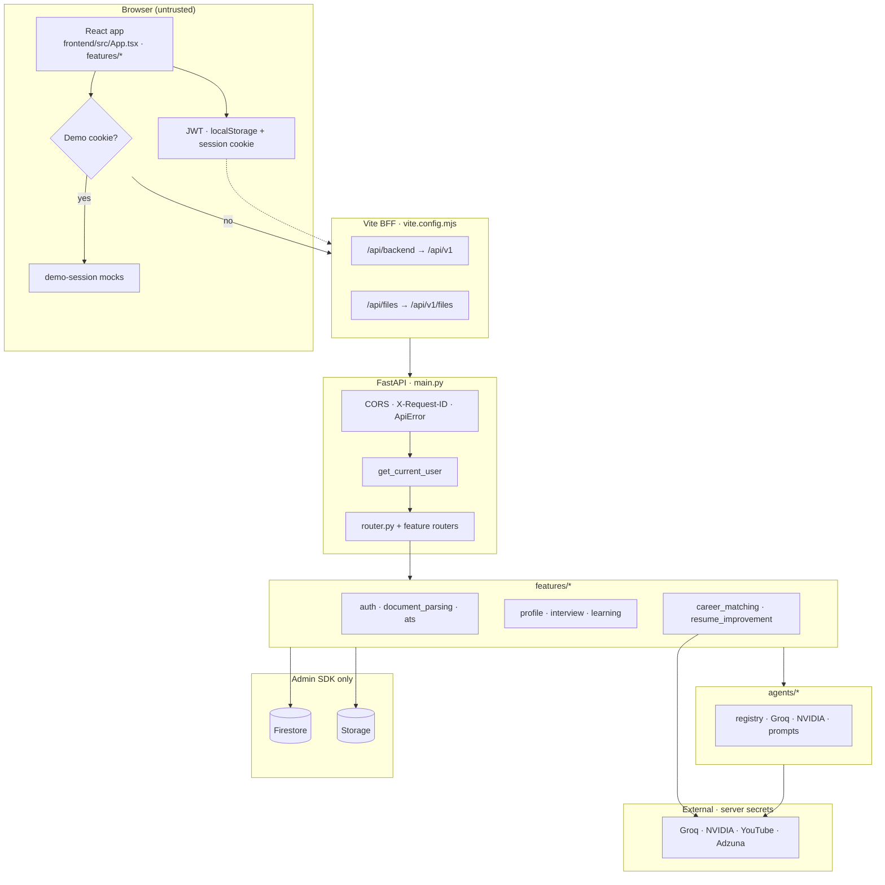

# Architecture

## Context and goals

Career Copilot is a **private career workspace** for one candidate at a time. It is a monorepo:

| Concern | Choice | Why |
|---------|--------|-----|
| UI | Vite + React 19 + TypeScript | Fast local DX, feature-folder UI, modern motion/3D on marketing/jobs |
| API | FastAPI + Pydantic v2 | Typed request/response, dependency injection, async-friendly |
| Database | Firebase Cloud Firestore | Cloud-backed multi-device workspace without self-hosting Postgres |
| Files | Firebase Storage (GCS via Admin SDK) | Resumes, avatars, exports under `{user_id}/…` |
| PDF text | Docling (+ fast extractors first) | Layout-aware extraction for modern resume PDFs |
| LLM | Groq + NVIDIA Integrate API | OpenAI-compatible chat; optional, with deterministic fallbacks |
| Secrets | Root `.env` server-only | Browser only sees `VITE_*` and never private keys |

### Product goals

1. **Evidence-grounded ATS** — score resumes against JDs with auditable keyword quotes.  
2. **Confirm gate** — extraction is reviewable; only confirmed content powers ATS/learning/jobs.  
3. **Helpful AI without invention** — LLMs plan, draft, and brief; they must not invent experience or video IDs.  
4. **Owned data lifecycle** — create, list, delete, and full account wipe.

### Non-goals

- Multi-tenant org admin / recruiter portal  
- AI hiring decisions or interview grading  
- Client-side Firestore access  
- Product path embedding/cosine ATS

---

## High-level system diagram

> Full Mermaid set (unified + product journey + sequences): **[diagrams.md](./diagrams.md)**.

### Unified view (Mermaid)



### ASCII overview (fallback)

```text
Browser (App.tsx + features/*)
  JWT localStorage + career_copilot_session
  demo cookie → in-browser mocks only
        │ same-origin /api/backend/*  /api/files/*
        ▼
Vite BFF (vite.config.mjs) → PUBLIC_API_BASE_URL + /api/v1
        ▼
FastAPI (main.py)  CORS · X-Request-ID · ApiError
  get_current_user → routers → features/*
        ├─► Firestore + Storage  (database/client.py, Admin SDK)
        └─► Groq / NVIDIA / YouTube / Adzuna  (server .env only)
```

---

## Layered backend design

```text
backend/app/
├── main.py                 # ASGI app composition only
├── core/                   # settings, constants, errors (no domain logic)
├── api/                    # HTTP surface: router.py, schemas.py
├── database/               # Firestore + storage adapters, ownership helpers
├── agents/                 # provider clients, prompt files, agent registry
└── features/               # domain modules (auth, parsing, ATS, …)
```

### Responsibility split

| Layer | Owns | Must not own |
|-------|------|--------------|
| `main.py` | App wiring, middleware, router mounts | Business rules |
| `core/` | Env config, constants, error shape | Feature algorithms |
| `api/router.py` | HTTP mapping, auth deps, orchestration | Low-level PDF math / keyword match details (calls features) |
| `database/` | Table allow-list, query chain, storage I/O | Feature scoring |
| `agents/` | LLM clients, rate limits, prompt loading | Product ATS score formula |
| `features/*` | Domain algorithms and crews | Transport details when possible |

**Why this shape:** `router.py` is large because many endpoints are thin orchestration over Firestore + one feature function. Heavier logic is extracted into `features/` modules so algorithms can be unit-tested without HTTP.

---

## Trust boundaries

```text
                    UNTRUSTED                         TRUSTED
┌─────────────────────────────────────┐   ┌─────────────────────────────┐
│ Browser / public network            │   │ FastAPI process             │
│ • UI code                           │──►│ • AUTH_SECRET               │
│ • JWT in localStorage/cookie        │   │ • Firebase service account  │
│ • VITE_FIREBASE_* (public web cfg)  │   │ • GROQ / NVIDIA / YouTube   │
│ • Never: LLM keys, service account  │   │ • Ownership checks          │
└─────────────────────────────────────┘   └──────────────┬──────────────┘
                                                         │ Admin SDK only
                                                         ▼
                                          ┌─────────────────────────────┐
                                          │ Firestore + Storage         │
                                          │ Client rules: deny all      │
                                          │ firebase/firestore.rules    │
                                          └─────────────────────────────┘
```

**Why deny-all Firestore rules?**  
The app treats the API as the only data path. Browser Firebase config is for **Auth (Google)** UX only, not for reading candidate rows. Ownership is enforced in Python via `user_id` filters (`database/repository.py`).

---

## Authentication architecture

| Piece | Location | Role |
|-------|----------|------|
| Password hash | `api/router.py` (`_password_hash` / `_password_matches`) | scrypt |
| JWT create/validate | `features/auth/service.py` | HS256, `sub` + `email` + `iat` + `exp` |
| Current user dep | `get_current_user` | Bearer header, else session cookie |
| Frontend session | `features/auth/api/client.ts` | save token + cookie |
| Google path | `features/auth/firebase.ts` → `POST /auth/firebase` | Verify Firebase ID token server-side, issue app JWT |

Algorithm constant: `core/constants.py` → `JWT_ALGORITHM = "HS256"`.  
Min password length: `MIN_PASSWORD_LENGTH` (currently **8**).

---

## Data path architecture

Firestore is accessed through a **Supabase-like query adapter** in `database/client.py`:

```text
client.table("resumes").select("*").eq("user_id", id).order(...).execute()
```

**Why an adapter?**  
Feature code and the large router can use a chainable API while the underlying store is Firestore (and storage can be Firebase or legacy Supabase storage depending on config). Table names are allow-listed (`_TABLES`) to prevent arbitrary collection access.

Ownership helpers:

- `owned_row` / `owned_rows` — always filter by `user_id`  
- `write_activity` / `list_recent_activity` — dashboard feed with prune cap  

---

## AI / agent architecture

```text
agents/registry.py
    │  lists capability for GET /agents/status
    ▼
agents/providers/
    nvidia_client.py   groq_client.py   rate_limit.py   common.py
    │
    ▼
feature agents (domain-specific)
    profile/agent/*          fill profile
    ats/agents/*             improvement brief
    interview/agent/*        questions
    learning/agents/crew/*   YouTube path
    resume_improvement/agents/crew/*  improve loop
    document_parsing/parsing/llm_sections.py  section map
```

Prompts live as versioned text files under `agents/prompts/*.txt`.

**Product ATS is intentionally not an agent.**  
Scoring is pure Python in `features/ats/ats_score.py`. LLMs only produce optional improvement briefs after the score is known.

---

## Frontend architecture

```text
main.tsx
  └── App.tsx          # route table + ProtectedRoute
        ├── marketing  # public landing
        ├── auth       # sign-in/up, password, verify
        └── workspace-shell
              └── lazy feature pages (dashboard, resume, interview, …)
```

Shared infrastructure:

| Module | Responsibility |
|--------|----------------|
| `shared/api/client.ts` | Authenticated `fetch`, GET dedupe, demo short-circuit |
| `shared/config.ts` | Token keys, demo cookie, API base resolution |
| `shared/routes.ts` | Canonical path constants |
| `vite.config.mjs` | `/api/backend` and `/api/files` reverse proxy |

---

## Key design decisions and trade-offs

| Decision | Trade-off |
|----------|-----------|
| Confirm gate before ATS | Extra UX step; prevents scoring unreviewed garbage extraction |
| Deterministic keyword ATS as product path | Transparent, testable; weaker “semantic” fit than embeddings |
| Optional LLM composite scorer kept as library | Research path without polluting product persistence |
| PDF: fast extract first, Docling fallback | Speed when text-rich; Docling for hard layouts |
| Section LLM assigns **line numbers only** | Model cannot rewrite resume body |
| YouTube IDs only from API | No hallucinated watch URLs; search-page fallback if key missing |
| No AI interview grading | Avoids fake “hireability” scores |
| Large `router.py` | Fast to wire endpoints; domain logic still in features |
| JWT in localStorage | Simple local app; XSS risk accepted for local-first product |

---

## Runtime configuration

Settings are loaded once via Pydantic Settings from **repo-root** `.env`:

- File: `backend/app/core/config.py`  
- Root path: `Path(__file__).resolve().parents[3] / ".env"`  

`get_settings()` is cached (`lru_cache`). Provider pair validation: if an API key is set, the matching model name is required.

---

## Related docs

- [Code map](./code-map.md) — file-by-file ownership  
- [Flows](./flows.md) — request sequences  
- [Data model](./data-model.md) — collections and statuses  
- [Operations](./operations.md) — run and diagnose  
