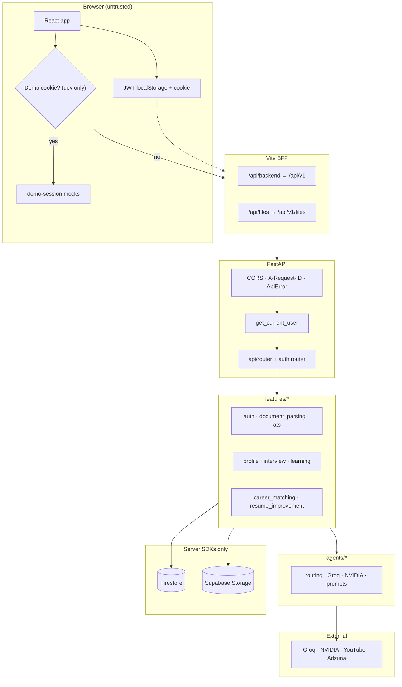

# Architecture

## Context and goals

Career Copilot is a **private career workspace** for one candidate at a time.

| Concern | Choice | Why |
|---------|--------|-----|
| UI | Vite + React 19 + TypeScript | Fast local DX, feature folders |
| API | FastAPI + Pydantic v2 | Typed contracts, DI, async-friendly |
| Database | Cloud Firestore | Cloud multi-device workspace without self-hosted Postgres |
| Files | **Supabase Storage** | Private objects; app streams via JWT-owned `/files` |
| PDF text | pypdf (+ optional faster backends) | Fast extract without ML converters |
| LLM | Groq preferred, NVIDIA fallback | OpenAI-compatible chat; deterministic fallbacks |
| Crews | CrewAI package optional | Official package when installed; else compatible sequential tools |
| Secrets | Root `.env` server-only | Browser only sees `VITE_*` |

### Product goals

1. **Evidence-grounded ATS** — auditable keyword quotes.  
2. **Confirm gate** — only confirmed resume/JD text powers ATS, learning, prep, job match.  
3. **Helpful AI without invention** — LLMs plan/draft/brief; never invent experience or video IDs.  
4. **Owned data lifecycle** — create, list, delete, full account wipe.

### Non-goals

- Multi-tenant recruiter portal  
- AI hiring decisions or interview grading  
- Client-side Firestore access  
- Product-path embedding/cosine ATS  

---

## High-level system



### ASCII fallback

```text
Browser → /api/backend | /api/files
        → Vite proxy → PUBLIC_API_BASE_URL + /api/v1
        → FastAPI (JWT ownership)
              ├─ Firestore (structured)
              ├─ Supabase Storage (files)
              └─ Groq / NVIDIA / YouTube / Adzuna
```

Full diagram set: [diagrams.md](./diagrams.md).

---

## Layered backend

```text
backend/app/
├── main.py                 # ASGI composition, CORS, middleware
├── core/                   # settings, constants, errors
├── api/                    # HTTP surface (router, schemas, auth)
├── database/               # Firestore + storage adapters, ownership helpers
├── agents/                 # providers, prompts, registry, preferred routing
└── features/               # domain modules
```

### Trust boundaries

| Boundary | Rule |
|----------|------|
| Browser | Untrusted; never holds service keys |
| Vite BFF | Dev/preview proxy only; not a second auth system |
| FastAPI | Authenticates JWT; owns all multi-tenant isolation |
| Firestore rules | Deny all client SDK access |
| Storage | Private bucket; bytes only via authenticated file route |

---

## Provider routing

`backend/app/agents/providers/routing.py`:

- `preferred_llm_provider(settings)` → `LLM_PROVIDER` (`groq` \| `nvidia`)  
- `preferred_llm_providers(settings)` → configured providers in preference order  

Agents that can use either provider (improvement brief, profile fill, resume suggestions, document sections) try **preferred first**, then the other, then deterministic behavior where defined.

Interview questions use **Groq only** (templates on failure). Product ATS score uses **no LLM**.

Optional **OmniRoute** (`OMNIROUTE_ENABLED`) can rewrite provider base URL/key when a local OpenAI-compatible sidecar is running; default is off.

---

## Data access notes

### Firestore recency

Firestore **excludes documents missing the `order_by` field**.  
Legacy rows may lack `created_at` but have `started_at` / `completed_at`.

**App rule:** for user-scoped “newest first” lists, fetch without relying solely on server `order_by(created_at)`, then sort with `sort_rows_by_recency` (`database/repository.py`). New writes always set `created_at`.

### Object storage

`ObjectStorage` uses:

1. In-memory backend when `APP_ENV=test`  
2. **Supabase Storage** when URL + service role + bucket are set  
3. Fail closed otherwise  

Logical prefixes: `DOCUMENT_BUCKET`, `AVATAR_BUCKET` inside `SUPABASE_STORAGE_BUCKET`.

---

## Key decisions

| Decision | Trade-off |
|----------|-----------|
| Confirm gate before ATS | Extra step; prevents scoring unreviewed OCR garbage |
| Deterministic product ATS | Less “smart,” more auditable |
| Supabase for files, Firestore for rows | Two clouds; clear ownership of each concern |
| Groq-first agents | Faster/cheaper default; NVIDIA remains fallback |
| No AI interview grading | Avoids false hiring signals |
| Demo cookie only in non-PROD | Production never serves empty in-memory mocks as real data |

---

## Related

- [Data model](./data-model.md)  
- [Operations](./operations.md)  
- [Features index](./features/README.md)  
