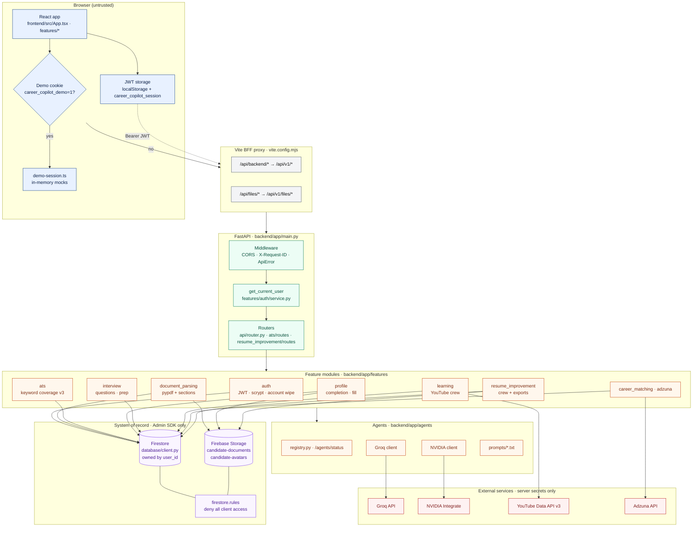
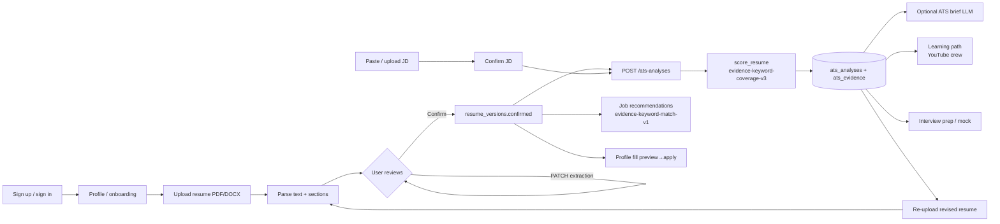
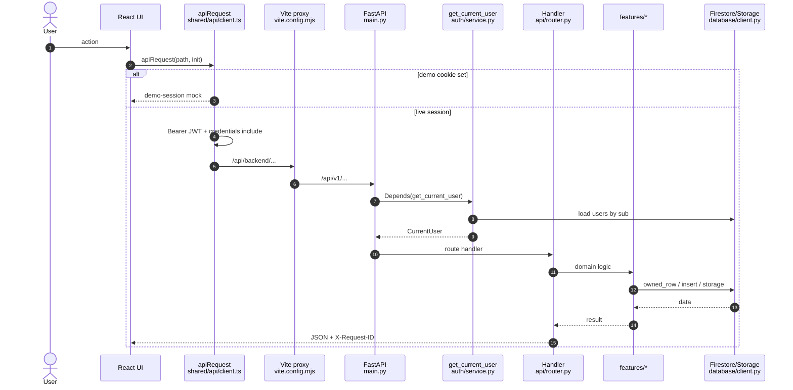
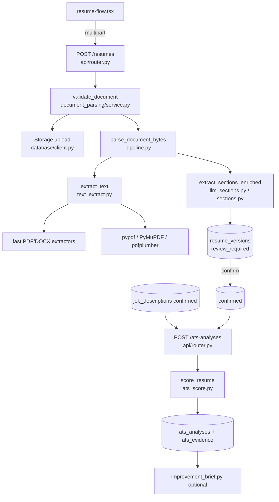
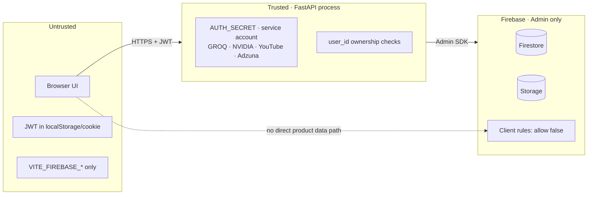

# System diagrams (Mermaid)

Unified view of Career Copilot: request path, domain features, data stores, and external services.

> Rendered on GitHub, VS Code (Mermaid preview), and most Markdown viewers that support Mermaid.

---

## 1. Unified system diagram

End-to-end architecture: browser → BFF → FastAPI → features → data & external APIs.

### How to read it

| Zone | Meaning |
|------|---------|
| **Browser** | Untrusted UI; JWT in storage; demo short-circuit never hits the API |
| **Vite BFF** | Same-origin proxy so the page avoids CORS; rewrites to `/api/v1` |
| **FastAPI** | Auth dependency + routers; secrets stay here |
| **Features** | Domain algorithms (parse, ATS, learning, …) |
| **Agents** | Optional LLM providers + prompt packs |
| **Data** | Firestore + Storage via Admin SDK; client rules deny all |
| **External** | Groq / NVIDIA / YouTube / Adzuna — keys never in `VITE_*` |

---

## 2. Product journey (confirm → outcomes)

Primary candidate loop: upload → confirm → score → optional downstream features.

---

## 3. Authenticated request sequence

One protected API call from UI to Firestore.

---

## 4. Resume → ATS data path (file-level)

---

## 5. Trust boundary

---

## Related docs

- [Architecture](./architecture.md) — narrative for the same system  
- [Flows](./flows.md) — step-by-step file citations  
- [Code map](./code-map.md) — where each node lives in the repo  
